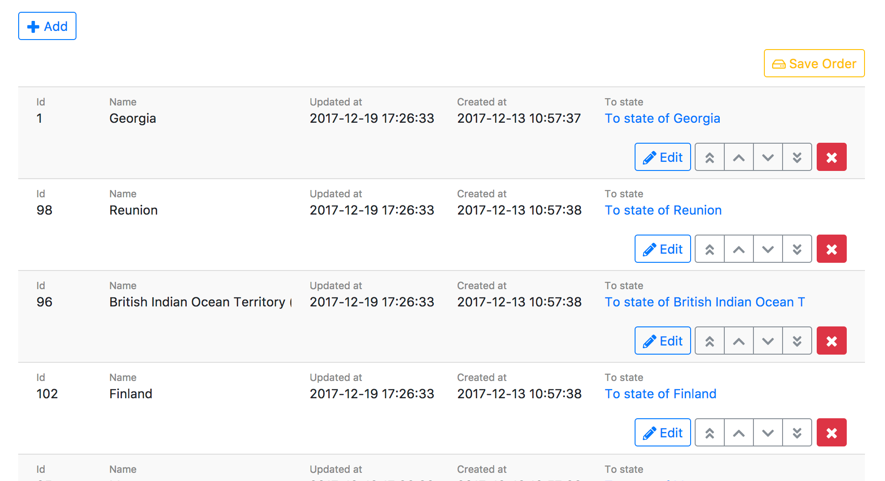
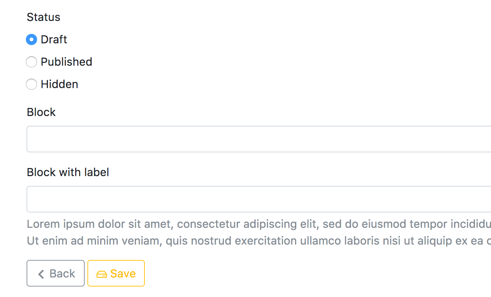
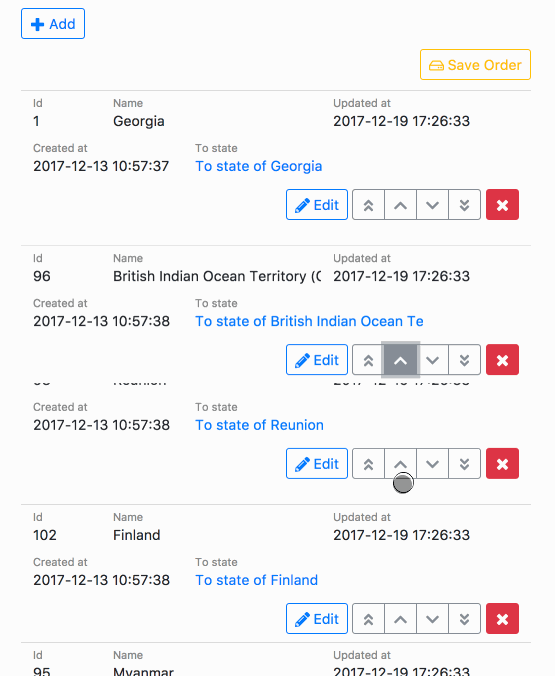

# DynamicScaffold
The Scaffold system which dynamically generates CRUD and sort functions.

## Feature

* This is generate the pages using same views dynamically.
* Support the responsive design and touch UI.
* Support sort and pagination.
* Support image upload with preview.
* Support image crop.
* Support [globalize](https://github.com/globalize/globalize) form fields.
* Support [cocoon](https://github.com/nathanvda/cocoon).
* This has the views with the Twitter Bootstrap. Support bootstrap3/4.
* Customizable and flexible.







## Installation

Add this line to your application's Gemfile:

```ruby
gem 'dynamic_scaffold', '~> 0.1'
```

And then execute:
```bash
$ bundle
```

## Usage

### Routes

Please call `dynamic_scaffold_for` method with the resource name.

```rb
# config/routes.rb
Rails.application.routes.draw do
  dynamic_scaffold_for 'shops'
end
```

This will generate the following routes.

```
sort_or_destroy_controls_master_shops PATCH /:locale/controls/master/shops/sort_or_destroy(.:format)     controls/shops#sort_or_destroy
                controls_master_shops GET   /:locale/controls/master/shops(.:format)                     controls/shops#index
                                      POST  /:locale/controls/master/shops(.:format)                     controls/shops#create
             new_controls_master_shop GET   /:locale/controls/master/shops/new(.:format)                 controls/shops#new
            edit_controls_master_shop GET   /:locale/controls/master/shops/:id/edit(.:format)            controls/shops#edit
                 controls_master_shop PATCH /:locale/controls/master/shops/:id(.:format)                 controls/shops#update
                                      PUT   /:locale/controls/master/shops/:id(.:format)                 controls/shops#update
```

### Generate controller and views

First, you need a model of the target table. If you have not generate it yet, please generate the model.

```
rails generate model Shop
```

Next, execute the following command for generate the controller and views.

```
rails generate dynamic_scaffold shops
      create  app/controllers/shops_controller.rb
      create  app/views/shops/edit.html.erb
      create  app/views/shops/index.html.erb
      create  app/views/shops/new.html.erb
```

You can also specify namespaces and the model name if you want.

```
rails generate dynamic_scaffold namespace/plural_model
rails generate dynamic_scaffold namespace/controller Model
```

#### Options

##### content_for

Enclose the `render` of view in `content_for`.

```
rails generate dynamic_scaffold admin/shops --content_for admin_body
```

```erb
# views/admin/shops/edit.html.erb
<% content_for :admin_body do%>
  <%= render 'dynamic_scaffold/bootstrap/edit' %>
<%end%>
```

##### controller_base

Change the base class of controller.

```
rails generate dynamic_scaffold admin/shops --controller_base Admin::BaseController
```

```erb
# controllers/admin/shops_controller.rb
class Admin::ShopsController < Admin::BaseController
  include DynamicScaffold::Controller
  dynamic_scaffold Shop do |config|
```


### Prepare CSS and Javascript

You need to load the files for CSS and Javascript.　Currently, we support the Bootstrap 3 and Bootstrap 4.

```sass
# app/assets/stylesheets/application.scss
@import 'dynamic_scaffold/bootstrap3'
# or
@import 'dynamic_scaffold/bootstrap4'
```

```js
// app/assets/javascripts/application.js
//= require dynamic_scaffold
```

### Customization

You can customize each items in the block passed as dynamic_scaffold method argument.

```rb
# app/controllers/shops_controller.rb
class ShopController < ApplicationController
  include DynamicScaffold::Controller
  dynamic_scaffold Shop do |config|
    # customize here
    # `config` is DynamicScaffold::Config
  end
end
```

#### Customize list


You can customize the list through the `DynamicScaffold::Config#list` property.

```rb
# app/controllers/shops_controller.rb
class ShopController < ApplicationController
  include DynamicScaffold::Controller
  dynamic_scaffold Shop do |config|
    # If you want filtering that can not be handled by `config.scope`, you can use the filter method.
    # Please note that returning nil will be ignored.
    config.list.filter do |query|
      query.where(parent_id: nil)
    end

    # You can set each title in the list header through title method.
    # Pass the attribute name,
    config.list.title(:name)
    # or
    # config.list.title do |record|
    #   record.name
    # end

    # You can add class to list page's each row.
    config.list.row_class do |record|
      'disabled' unless record.active?
    end
  
    # First arg is attribute name of model.
    # Last hash arg is given to HTML attributes options.
    # `label` method change the label (I18n model attribute name is default).
    config.list.item(:id, style: 'width: 80px').label('Number')
    config.list.item :name, style: 'width: 120px'

    # If you want to call a model method, specify the block.
    config.list.item :updated_at, style: 'width: 180px' do |rec, name|
      rec.fdate name, '%Y-%m-%d %H:%M:%S'
    end

    # The first argument can also be omitted, to display item that is not model attribute.
    # The block is executed in the context of view, so you can call the method of view.
    config.list.item do |rec|
      link_to "Show #{rec.name}", controls_master_shops_path
    end

    # You can hide item by calling the show_only method.
    config.list.item(:name).show_only {|rec| rec.foobar? }
  end
end
```

#### Customize form

You can customize the form through the `DynamicScaffold::Config#form` property.

```rb
# app/controllers/shops_controller.rb
class ShopController < ApplicationController
  include DynamicScaffold::Controller
  dynamic_scaffold Shop do |config|
    # config.form.item(type, name, html_attributes)
    # or
    # config.form.item(type, name, options, html_attributes)
    #
    # You can use form helper methods for type,
    # text_field, check_box, radio_button, password_field, hidden_field, file_field, text_area, color_field,
    # collection_check_boxes, collection_radio_buttons, collection_select, grouped_collection_select,
    # time_select, date_select, datetime_select, date_field, number_field, telephone_field


    # Default label is I18n model attribute name.
    config.form.item :text_field, :name
    # You can specify `label`. You can specify tag attributes for the second argument.
    config.form.item(:text_field, :name).label('Shop Name', class: 'h3')
    # You can pass the block and customize the label tag.
    config.form.item(:text_field, :name).label do |text, depth, attrs|
      # This block is called in the scope of view, 
      # So methods and variables that can be used in view are available.
      tag.div class: 'h3 mb-1' do
        tag.label text
      end
    end

    # You can set default value for new action.
    config.form.item(:text_field, :name).default('Foo Bar')
    # default also accept block.
    config.form.item(:text_field, :name).default do
      Shop.find_by(shop_id: params[:shop_id])
    end

    # If you use hidden_field, the label will also be hidden.
    config.form.item :hidden_field, :id
    # but if you specify the label explicitly it will be displayed.
    config.form.item(:hidden_field, :id).label 'ID'

    # Last hash arg is given to HTML attributes.
    config.form.item :text_area, :memo, rows: 8

    # Methods of the collection conform to the [ActionView::Helpers::FormBuilder](https://apidock.com/rails/ActionView/Helpers/FormBuilder) method.
    config.form.item(:collection_select, 
      :category_id, Category.all, :id, :name, include_blank: 'Select Category'
    )
    config.form.item(:collection_check_boxes, :state_ids, State.all, :id, :name)
    config.form.item(:collection_radio_buttons, :status, Shop.statuses.map{|k, _v| [k, k.titleize]}, :first, :last)

    # If you want to use parameters to get list, Pass Proc or Lambda to argument. It will be called in view scope.
    config.form.item(:collection_select, :status, -> { Shop.where(area_id: params[:area_id]) }, :first, :last)

    # If you want to display more free form field, use block.
    # The block is executed in the context of view, so you can call the method of view.
    config.form.item :block, :free do |form, field|
      content_tag :div, class: 'foobar' do
        form.text_field field.name, class: 'foobar'
      end
    end

    # The label of block method also accepts block.
    config.form.item(:block, :free).label 'Free Value' do |form, field|
      content_tag :div, class: 'foobar' do
        form.text_field field.name, class: 'foobar'
      end
    end

    # You can insert HTML before/after the element.
    config.form.item(:file_field, :image).label('Image').insert(:after) do |rec|
      tag.label for: :delete_image do
        concat tag.input type: :checkbox, id: :delete_image, name: 'shop[delete_image]'
        concat 'Delete image'
      end
    end

    # IF You need to permit the new form parameters,  Call config.form.permit_params.
    config.form.permit_params(:delete_image)

    # You can also add a note to the form field.
    config.form.item(:text_field, :name).note do
      concat(tag.p do
        'Lorem ipsum dolor sit amet, consectetur adipiscing elit, '
      end)
      concat(tag.p do
        'sed do eiusmod tempor incididunt ut labore et dolore magna aliqua.'
      end)
    end
  end
end
```

##### carrierwave_image

You can add an image uploader with preview to the form. It uses [carrierwave](https://github.com/carrierwaveuploader/carrierwave) to save images and associate with records.

For example, you mount the carrierwave uploader on the `thumb` column of Shop model.

```rb
class Shop < ApplicationRecord
  mount_uploader :thumb, ShopThumbUploader
```

The controller code is as follows.

```rb
class ShopController < ApplicationController
  include DynamicScaffold::Controller
  dynamic_scaffold Shop do |config|
...
    config.form.item(
      :carrierwave_image,
      :thumb,
      preview_max_size: {width: '300px', height: '300px'},
      removable: false #　If you want to require image, please set removable to false. the default is true.
    )
```

The `carrierwave_image` supports [cropper](https://github.com/fengyuanchen/cropperjs) too. For details, please read [Crop the image](https://github.com/gomo/dynamic_scaffold/wiki/Crop-the-image).


##### globalize_fields

We support [globalize](https://github.com/globalize/globalize). Below is the controller code.

```rb
class ShopController < ApplicationController
  include DynamicScaffold::Controller
  dynamic_scaffold Shop do |config|
...
    c.form
      # Each language input field specified in the second argument will generate.
      .item(:globalize_fields, { en: 'English', ja: 'Japanese' }, style: 'width: 78px;')
      # You can specify the type of element to generate to `for` method. it support `:text_field` or `:text_area` for type.
      # Specify the attribute name in the second argument of the `for` method.
      .for(:text_field, :keyword)
```

Setting the model for globalize_fields with validates is [here](https://github.com/gomo/dynamic_scaffold/wiki/Model-setting-for-globalize).


##### cocoon

We support [cocoon](https://github.com/nathanvda/cocoon).

```rb
  # Build the form of related records in the block.
  c.form.item(:cocoon, :shop_memos, add_text: 'Add Memo') do |form|
    # This `form` is a form of the child hierarchy generated by `fields_for`.
    form.item(:hidden_field, :id)
    form.item(:text_field, :title)
    form.item(:text_area, :body)
  end.filter do |records|
    # If you want to sort the related records, please process in the filter block.

    # The records with empty id are first, then in descending order of id
    records.partition do |rec|
      rec.id.nil?
    end.yield_self do |nils, others|
      nils + others.sort_by {|rec| -rec.id }
    end
  end
```

##### json_object

You can save json object string in a column using each form items and validations.
Check this [wiki](https://github.com/gomo/dynamic_scaffold/wiki/Handling-json-object-string-column)


#### Overwrite actions

You can pass the block to super in index/create/update actions.

```rb
def index
  super do |records|
    # `records` is ActiveRecord::Relation.
    # You must return ActiveRecord::Relation instance.
  end
end

def update|create
  super do |record|
    # `record` is a Model.
    # This block is called before saving.
  end
end
```


### Sorting

You can sort records having integer column for order in the list page.

```rb
class CreateCountries < ActiveRecord::Migration[5.1]
  def change
    create_table :countries do |t|
      t.string :name
      t.integer :sequence
    end
  end
end
```

```
rails generate dynamic_scaffold countries
```

```rb
# app/controllers/countries_controller.rb
class CountriesController < ApplicationController
  include DynamicScaffold::Controller
  dynamic_scaffold Country do |config|
    config.list.sorter sequence: :desc
    ...
```



### Pagination

You can enable pagination with [kaminari](https://github.com/kaminari/kaminari).

```rb
# app/controllers/shops_controller.rb
class ShopController < ApplicationController
  include DynamicScaffold::Controller
  dynamic_scaffold Shop do |config|
    config.list.pagination per_page: 20
    ...
```

The following options are available for the pagination.

```
window: 0,                # kaminari options
outer_window: 0,          # kaminari options
left: 0,                  # kaminari options
right: 0,                 # kaminari options
param_name: :page,        # kaminari options
total_count: true,        # Whether to display total count and active page, like `2/102`.
end_buttons: true,        # Whether to display buttons to the first and last page.
neighbor_buttons: true,   # Whether to display buttons to the next and prev page.
gap_buttons: false,       # Whether to display gap buttons.
highlight_current: false, # Whether to highlight the current page.
```

### Scoping

You can scoping for target items by url param.

For example, you create the Scaffold of users for each role.
```rb
create_table :users do |t|
  t.string :email, null: false
  t.string :encrypted_password, null: false
  t.integer :role, limit: 2, null: false
end

class User < ApplicationRecord
  enum role: { admin: 1, staff: 2, member: 3 }
end
```

Set the route as follows.

```rb
Rails.application.routes.draw do
  dynamic_scaffold_for 'users/:role', controller: 'users', as: 'users', role: Regexp.new(User.roles.keys.join('|'))
end
```

```
sort_or_destroy_controls_master_users PATCH /:locale/controls/master/users/:role/sort_or_destroy(.:format)  controls/users#sort_or_destroy {:role=>/admin|staff|member/}
                controls_master_users GET   /:locale/controls/master/users/:role(.:format)                  controls/users#index {:role=>/admin|staff|member/}
                                      POST  /:locale/controls/master/users/:role(.:format)                  controls/users#create {:role=>/admin|staff|member/}
             new_controls_master_user GET   /:locale/controls/master/users/:role/new(.:format)              controls/users#new {:role=>/admin|staff|member/}
            edit_controls_master_user GET   /:locale/controls/master/users/:role/:id/edit(.:format)         controls/users#edit {:role=>/admin|staff|member/}
                 controls_master_user PATCH /:locale/controls/master/users/:role/:id(.:format)              controls/users#update {:role=>/admin|staff|member/}
                                      PUT   /:locale/controls/master/users/:role/:id(.:format)              controls/users#update {:role=>/admin|staff|member/}
```

For the controller, as follows.

```rb
# app/controllers/users_controller.rb
class UsersController < ApplicationController
  include DynamicScaffold::Controller
  dynamic_scaffold User do |c|
    c.scope [:role]
    ...
```

The scope can fix value also.

```rb
# app/controllers/users_controller.rb
class UsersController < ApplicationController
  include DynamicScaffold::Controller
  dynamic_scaffold User do |c|
    c.scope [{role: :admin}]
    # or if you use only fixed values, you can use Hash
    c.scope role: :admin
    ...
```

By default, the value can not update to a value other than the value specified in the scope( or parameter). This behavior can change with `changeable` option.

```rb
# app/controllers/users_controller.rb
class UsersController < ApplicationController
  include DynamicScaffold::Controller
  dynamic_scaffold User do |c|
    c.scope([:role], changeable: true)
    ...
```

#### Limit count

You can specify the maximum count of registrations.

```rb
# app/controllers/users_controller.rb
class UsersController < ApplicationController
  include DynamicScaffold::Controller
  dynamic_scaffold User do |c|
    c.max_count 10
    ...
```

If database support lock, you can lock the table before count.

```rb
# app/controllers/users_controller.rb
class UsersController < ApplicationController
  include DynamicScaffold::Controller
  dynamic_scaffold User do |c|
    c.max_count 10, lock: true
    ...
```

If you want a finer lock control, you can use the block.

```rb
# app/controllers/users_controller.rb
class UsersController < ApplicationController
  include DynamicScaffold::Controller
  dynamic_scaffold User do |c|
    c.max_count 10 do |record|
      ActiveRecord::Base.connection.execute("...")
    end
    ...
```

Please note that the count of records is affected by scope and list.filter.

### View helper

#### dynamic_scaffold.title


You can set and get the title of the pages.


```erb
# app/views/your_resources/list.html.erb
<%= dynamic_scaffold.title.current.name %>
<!-- Shop -->

<%= dynamic_scaffold.title.current.action %>
<!-- List -->

<%= dynamic_scaffold.title.current.full %>
<!-- Shop List -->
```

You can get another action title through the action name method too.

```erb
# app/views/your_resources/list.html.erb
<%= dynamic_scaffold.title.new.full %>
<!-- Create Shop -->
```

If you want change from the model name, set `config.title.name`.

```rb
# app/controllers/shops_controller.rb
class ShopController < ApplicationController
  include DynamicScaffold::Controller
  dynamic_scaffold Shop do |config|
    config.title.name = 'Model'
    ...
```

If you want to dynamically set according to url parameters, you can also use block.

```rb
# app/controllers/shops_controller.rb
class ShopController < ApplicationController
  include DynamicScaffold::Controller
  dynamic_scaffold Shop do |config|
    config.title.name do
      I18n.t "enum.user.role.#{params[role]}", default: params[role].titleize
    end
```

#### dynamic_scaffold_path

You can get the path by specifying the action name. Below is an example of displaying breadcrumbs.

```erb
<ol class="breadcrumb">
  <%= yield :breadcrumb_before %>
  <% if params['action'] == 'index' %>
    <li class="active"><%= dynamic_scaffold.title.current.name %></li>
  <% else %>
    <li><%= link_to dynamic_scaffold.title.index.name, dynamic_scaffold_path(:index) %></li>
    <li class="active"><%= dynamic_scaffold.title.current.action %></li>
  <% end %>
</ol>
```

#### dynamic_scaffold.vars

You can cache, such as data to be displayed multiple times in a view using `dynamic_scaffold.vars`.

```rb
# app/controllers/shops_controller.rb
class ShopController < ApplicationController
  include DynamicScaffold::Controller
  dynamic_scaffold Shop do |config|
    config.title.vars :shop_type do
      ShopType.find(params['shop_type_id'])
    end
    ...
```

```rb
# in your view
<%= dynamic_scaffold.vars.shop_type.name %>
```


## Contributing

* We use rspec for test.
* Check code with [rubocop](https://github.com/bbatsov/rubocop).

### Development hints.

Please support both Bootstrap 3/4. You can change CSS to Bootstrap3 by registering `bootstrap=3` in cookie in the sample page.

## License
The gem is available as open source under the terms of the [MIT License](http://opensource.org/licenses/MIT).
